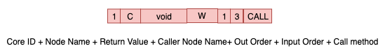
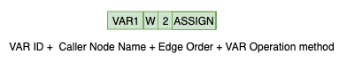
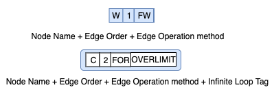
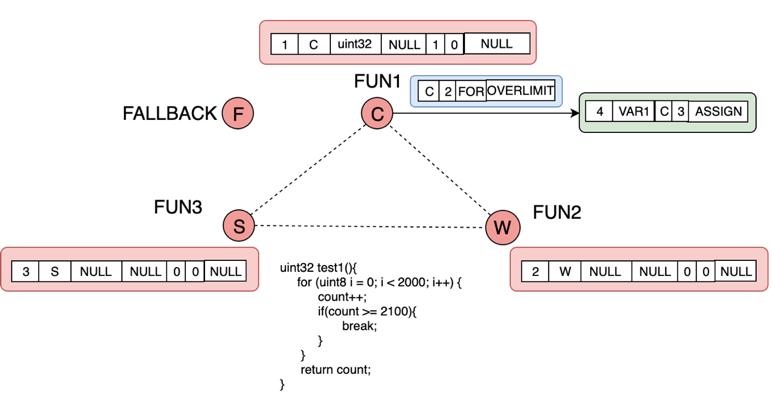
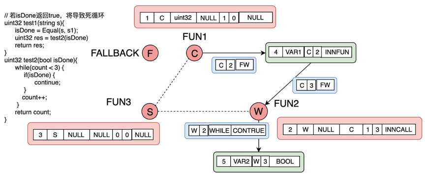
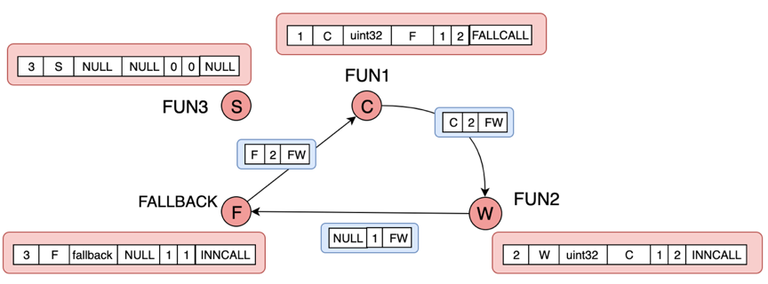

# VntInfiniteLoopDetector

This repo is a python implementation of smart contract vulnerability detection based on graph neural network (GCN). In this research work, we focus on the infinite loop of smart contracts. All of the infinite loop types we concerned about are implemented by C/C++ of [VNT](https://github.com/vntchain/go-vnt). By the way, [VNT](https://github.com/vntchain/go-vnt), similar to Ethereum, is the next generation of commercial-grade intelligent value delivery infrastructure, which is dedicated to solving the problem of high energy consumption and low efficiency in the current public chain.

We implemented a dozen infinite loop cases using the Vntchain smart contract language. Then, we implement and use the automation tool  (AutoExtractGraph) to extract the graph from smart contracts and convert them into vectors (graph2vec). The results of model training and model evaluation are given below.

## Requirements

#### Required Packages
* **python**3
* **PyTorch**
* **sklearn** for model evaluation
* **go-vnt** as a vntchain platform support

Run the following script to install the required packages.
```shell
pip install --upgrade pip
pip install torch
pip install scikit-learn
```

### Required Dataset
This repository contains the Vntchain smart contract dataset related to the infinite loop task. So far, we have designed and deployed Vntchain smart contracts for infinite loop task, which it refers to the extracted graph structure from the smart contract. The advantage of using a deep learning neural network is that it can quickly adapt to new situations.  Moreover, it can achieve automation detection or even exceed the artificial effect with sufficient data.

We have deployed more than 4,000 smart contracts on the Vntchain [Mainnet](https://scan.vntchain.io/contracts) and [Testnet](https://hubscan.vnt.link/contracts), respectively. 

Vntchain smart contacts: [Vntchain_contract](https://drive.google.com/open?id=1FTb__ERCOGNGM9dTeHLwAxBLw7X5Td4v)


### Data structure
All of the Vntchain smart contract source code and graph dataset in these folders in the following structure respectively.
```shell
${VntInfiniteLoopDetector}
├── data/SMART_CONTRACT_VNT
│   ├── SMARTCONTRACT_A.txt
│   ├── SMARTCONTRACT_graph_indicator.txt
│   ├── SMARTCONTRACT_graph_labels.txt
│   ├── SMARTCONTRACT_node_attributes.txt
│   └── SMARTCONTRACT_node_labels.txt
├── graph_data
│   ├── edge
│   ├── node
│   └── result
└── vnt_contract
    └── examples
    └── infinite_loop
      └── infinite_loop_fallback
      └── infinite_loop_for
      └── infinite_loop_function_call
      └── infinite_loop_while
    └── regular_contract
      └── fallback
      └── for
      └── function_call
      └── while
    └── contracts
```
* `data/SMART_CONTRACT_VNT`: This is the dataset that it can be trained for VNT smart contract infinite loop task. Among them, it includes the label of the graph, the feature of the nodes, the adjacency matrix of the graph, and others.
* `graph_data/edge`: It includes all edges and edge attributes of each smart contract graph structure.
* `graph_data/node`: It includes all nodes and node attributes of each smart contract graph structure.
* `graph_data/result`: This is the feature vector of all points after feature ablation.
* `vnt_contract/examples`: There are some Vntchain smart contract instances, includes the official example of `dice.c`.
* `vnt_contract/infinite_loop`: This contains the current completed 
Vntchain smart contracts related to an infinite loop, includes `fallback`, `for`, `while` and `function infinite call`.
* `vnt_contract/regular_contract`: These smart contracts are similar to the above, but it is normal.

### Code Files
The tools and models are as follows:
```shell
${VntInfiniteLoopDetector}
├── tools
│   ├── AutoExtractGraph.py
│   ├── graph2vec.py
│   └── vec2onehot.py
├── models
│   ├── gcn_modify.py
│   └── layers.py
└── InfiniteLoopDetector.py
```

`InfiniteLoopDetector.py`
* Interface to project, uses functionality from other code files.
* Loads dataset, trains gcn model, passes to neural network, models evaluation.

`graph2vec.py`
* Feature ablation.
* Converts graph into vectors.

`AutoExtractGraph.py`
* All functions in the smart contract code are automatically split and stored.
* Find infinite loop call relationships between functions.
* Find out the infinite loop caused by for, while, and fallback.
* Extract all infinite loops into features of nodes and edges.

**Note:** The graph structure automation extraction tool is being improved.

## Running project
* To run the program, use this command: python InfiniteLoopDetector.py.
* Also, you can use specific hyperparameters to train the model. All the hyperparameters can be found in `parser.py`.

Examples:
```shell
python InfiniteLoopDetector.py --model gcn_modify
python InfiniteLoopDetector.py --model gcn_modify --n_hidden 192 --lr 0.001 -f 64,64,64 --dropout 0.1 --epochs 50 --lr_decay_steps 10,20 
```

Using script：
Repeating 10 times for different seeds with `train.sh`.
```shell
for i in $(seq 1 10);
do seed=$(( ( RANDOM % 10000 )  + 1 ));
python InfiniteLoopDetector.py --model gcn --seed $seed | tee logs/smartcheck_"$i".log;
done
```
Then, you can find the training results in the `logs`.

## Infinite Loop 
Infinite loop refers to the situation in which the control flow of the program has been repeatedly running a certain piece of code and cannot be ended. The reason may be that the loop in the program does not have an end loop condition, or the condition for ending the loop cannot be established. 
Losses caused by infinite loops in smart contracts are directly related to our interests. Therefore, we analyze the infinite loop of smart contracts and try to prevent the occurrence of this vulnerability through deep learning. The following is a case study of the Vntchain Smart Contract Infinite Loop:
### Attribute tag
In the analysis below, we abstract the smart contract into four core nodes: S, W, C, F. S, W, C are used as three function nodes to process the loop call relationship; the fallback function is used as the fourth type node F. 
Second, we add a VAR node to represent the variable statement in the contract, and the VAR node will be ablated to the core nodes. The attributes of nodes and edges are as follows:

(1) Core node attributes
<div align=center></div>
(2) VAR attributes
<div align=center></div>
(3) Edge attributes
<div align=center></div>

### For
<div align=center></div>
The above figure shows an infinite loop case where a For loop may exist in a smart contract. The type of i is uint8, and the maximum value of this type variable is 255, so it will cause an infinite loop. In this case, we mark it as an infinite loop by adding the "OVERLIMIT" flag, and the corresponding "INNLIMIT" flag is used as a normal loop.

### While
<div align=center></div>
The above figure shows an infinite loop case in which the While loop in the smart contract exists. When "isDone" is True, the while will always execute, resulting in an infinite loop. In this case, we also mark the case where the while is always established by adding the "CONTRUE" flag, that is, the infinite loop flag, and the corresponding "CONNORM" flag is used as the condition.

### Fallback
<div align=center></div>
The above figure shows an infinite loop case of the fallback function call in the smart contract. Here are four types of function nodes S, W, C, F.
C calls the W function, when the W function is input incorrectly or empty, it will cause the W function to call the Fallback function F. Moreover, C function is called by default in F, which leads to the generation of an infinite loop. 
In the C function, we use the "FALLCALL" flag to call F.

## Models and Results
### GCN
Smart contract data is unstructured data. The most suitable neural network model for processing unstructured data is the graph neural network model. The Graph Convolution Networks (GCN) input is a graph structure with a Euclidean structure. We extract the smart contract data into nodes and edges, for example:
For the graph G = (V, E), we use the following characteristics:
(1) Node feature: Each node i has its characteristics, which can be represented by a matrix X<sub>N*D</sub>, where N represents the number of nodes and D represents the number of features of each node.
(2) Edge feature: The information of the edge can be represented by the adjacency matrix A.

<div align=center></div>

### result
Average of all the evaluation for 5-fold cross-validation. The performance evaluation of the model is shown in the following table. We also repeat experiments 10 times to calculate the average. The performance evaluation results on the `SmartContract.txt` dataset are given below. 

| Model | Accuracy(%) | Recall(%) | Precision(%) |False positive rate(FP)(%) | False negative rate(FN)(%) | F1 score(%) |
| ------------- | ------------- | ------------- | ------------- |  ------------- |  ------------- |  ------------- |
| **GCN** | 86.87 | 90.88 | 84.33 | 15.67 | 9.12 | 86.83 |
| **GCN + A^2 + 2I** | 86.22 | 86.33 | 85.45 | 14.55 | 13.67 | 84.74 |
| **GCN with remove D**| 93.26 | 92.56 | 92.24 | 7.76 | 7.44 | 91.86 |
| **GCN with remove D + A^2 + 2I** | 94.66 | 94.41 | 94.67 | 5.33 | 5.59 | 94.22 |

These results were obtained by running:

`python InfiniteLoopDetector.py --model gcn_modify --dropout 0.1 --epochs 50
`

## References
1. VNT Document. [vnt-document](https://github.com/vntchain/vnt-documentation).
2. Graph classification with Graph Convolutional Networks in PyTorch. [graph_nn](https://github.com/bknyaz/graph_nn).
3. Smart contract vulnerability detection based on graph neural network (GCN). [GraphDeeSmartContract](https://github.com/Messi-Q/GraphDeeSmartContract).
4. Thomas N. Kipf, Max Welling, Semi-Supervised Classification with Graph Convolutional Networks, ICLR 2017. [GCN](https://arxiv.org/abs/1609.02907).